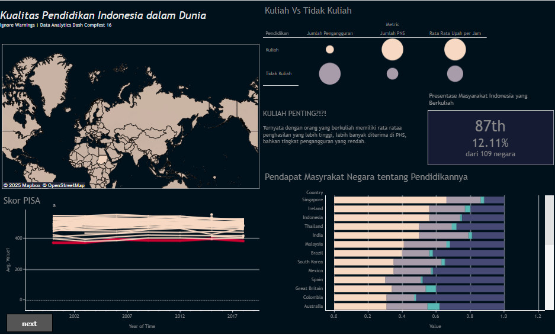

# Understanding Education Costs in Indonesia: A Data Analytics Dashboard

This project is an assignment for the final stage of the Data Analytics Dash COMPFEST 16 UI. We were given 2 weeks to collect data, analyze it, and create an interactive dashboard using Tableau. My team consist of three: **Hafid Sasayuda Ambardi, Muhammad Dafa Wisnu Galih, and Joseph Greffen Komala (Me).**

The objectives of the dashboard were given below:
1. **Understand Public Perception on Education Costs in Indonesia**
    Explore and visualize public concerns regarding the affordability of education at different levels, particularly higher education, based on data from social media and surveys.
2. **Identify Economic Barriers to Higher Education**
    Analyze data to uncover the economic factors contributing to low enrollment rates in higher education and disparities between provinces.
3. **Facilitate Policy Recommendations**
    Provide insights to stakeholders and policymakers to address the rising costs of education and improve accessibility for all societal groups.

You can check the published original dashboard here:

[Dashboard](https://public.tableau.com/app/profile/joseph.greffen.komala/viz/IgnoreWarnings/joseph?publish=yes)
## Key Insights and Dashboard Features

The dashboard offers a detailed analysis of the affordability of higher education in Indonesia through multiple visualizations and interactive elements. This dashboard not only highlights economic barriers to higher education but also serves as a tool for stakeholders to design targeted interventions that bridge accessibility gaps.

##### **The Educational Landscape in Indonesia: Challenges and the Importance of Higher Education**
Indonesia still faces significant challenges in its educational landscape. This is evidenced by low baseline scores in assessments like PISA. The dashboard shows Indonesia's PISA scores, which generally hover below 400 over the years, indicating a need for improvement in educational quality. There is also a notable lack of individuals pursuing higher education, with only 12.11% of the Indonesian population attending college, placing Indonesia 87th out of 109 countries in this regard. However, attending college is crucial as it has been proven to significantly enhance one's quality of life

### 1. Rising Discussion Trends on X (formerly Twitter)

A prominent feature is a line graph displaying the increase in tweets discussing "education costs" between 2020 and 2024, showing a significant spike in the past year. A corresponding word cloud highlights frequently mentioned terms such as "kuliah" (college), "tinggi" (high), "mahal" (expensive), and "biaya" (cost), clearly underscoring the growing public concern over higher education expenses. This section highlights how society has become increasingly concerned about this issue.

### 2. Perception of High Education Costs

A donut chart visually represents survey results from Kompas, indicating that over 60% of respondents perceive higher education costs as unaffordable. This perception is consistent across both public and private universities. This directly supports the finding that the high cost of education is a major barrier.

### 3. Economic Context of Rising Costs

A comparative analysis of education costs across different levels (elementary to university) reveals a dramatic 1.8x increase when transitioning from high school to college, based on data from the Ministry of Education. This section underscores how the cost of higher education is disproportionately high compared to prior education levels.

### 4. Regional Disparities in Affordability

An interactive map of Indonesia highlights provincial differences in the cost of higher education relative to the regional minimum wage (UMP). On average, tuition fees amount to 85.94% of the UMP nationwide, with provinces like Maluku showing even more stark disparities (124% of UMP). We also highlight how expensive higher education costs are by comparing them to the UMP of each province. Users can leverage filters to explore specific provinces and university types, providing granular insights into regional affordability challenges.

### 5. Insights on Public vs. Private Universities
Contrary to common expectations, the analysis reveals that public universities often have higher tuition fees compared to private institutions. This finding challenges the conventional perception of public universities as inherently providing more affordable education.

### Additional Insights and Supporting Visualizations

Beyond the core objectives, the dashboard also presents other crucial information:

- **Impact of Higher Education:** Visualizations illustrate that individuals with higher education tend to have higher average incomes, are more likely to be accepted into civil servant (PNS) positions, and experience lower unemployment rates.
- **PISA Scores:** The dashboard displays Indonesia's PISA scores over time, offering a benchmark for educational quality.
- **Public Perception of Education:** Insights into general public sentiment regarding education are also provided.
- **University Distribution and Scholarships:** The dashboard features visualizations showing the number and ratio of universities in each province. It also highlights scholarship programs as effective initiatives to promote education and accessibility.

### Lampiran: 
- **📊 Data Source and Documentation:** [**View Data Source & Documentation**](https://drive.google.com/file/d/1KMZEy6qXwUG61b4F8sBYz_FKkocxDz8s/view?usp=sharing)
- **📈 Dashboard:** [**Interactive Dashboard | Public Tableau**](https://public.tableau.com/app/profile/joseph.greffen.komala/viz/IgnoreWarnings/joseph?publish=yes)
