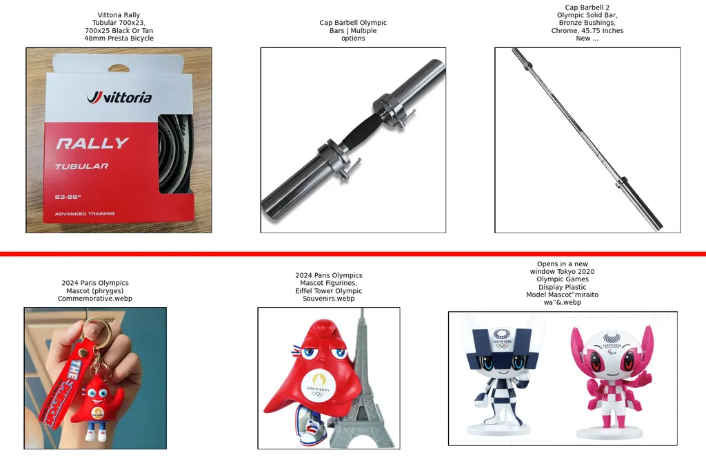

# Integration of Named Entity Recognition (NER) and Trend-Based Query Expansion to Enhance Multimodal Search Engine Relevance

## 🎯 Project Objectives
This project was an assignment for the final stage of the RISTEK Datathon 2024. It focused on enhancing the development of product search engines in e-commerce using machine learning. Our team was given 19 days to collect data, analyze it, and develop a product search engine method using the provided data.

The research results and experiments were documented in a technical report, accompanied by presentation slides to explain the idea during a presentation in front of judges. The presentation process was also recorded in a video. The primary goal was to improve product search engine relevance by better understanding user intent and dynamically expanding queries.

## 📝 Methodology
In this study, we combined a multimodal search engine with a Trend-Based Query Expansion (TBQE) mechanism and Named Entity Recognition (NER) as a categorizer and search result optimizer. A multimodal search engine leveraging both visual and textual data can provide broader and more accurate context in product searches. By integrating NER, the system effectively recognizes trends, categorizes, and filters search results to maximize the relevance of product results. This combination not only enhances the user experience but also improves transaction rates in the e-commerce marketplace.

The overall architecture of the system integrates these three core components to process user queries and deliver highly relevant product results:

### 1. Multimodal Search Engine Design
The multimodal search engine is capable of processing both visual and textual data to enhance search context.
* **Main Dataset**: We used part of the Marqo-GS-10M data, which in total contains around 100 thousand (98,286) queries from the generation results with the GPT-4 model.
* **Search Engine Model**: We utilized a model developed by Marqo, obtained by fine-tuning the CLIP-Vit-L-14 model with the Generalized Contrastive Learning (GCL) approach. Marqo fine-tunes the model using the entire Marqo-GS-10M data.
* **Database**: We chose Qdrant as our vector database to store and organize data using vector embedding due to its strong performance, flexibility, and scalability. A key advantage of Qdrant is its Max Similarity assessment, which efficiently evaluates the maximum similarity between each pair of vectors, facilitating the retrieval of relevant items.

### 2. Named Entity Recognition (NER) System Design
For NER, we fine-tuned the `bltlab/queryner` model, augmenting it with training data generated by the GPT-4o model. This custom dataset for fine-tuning includes entities such as "brand," "product," "material," "color," "pattern," and "size". The fine-tuning process utilized Hugging Face's `Trainer` API.

### 3. Trend-Based Query Expansion (TBQE) System Design
For TBQE, we created a vector database containing emerging trends, manually collected from e-commerce trends. These trends were embedded using the Marqo model.

When a query is received, its similarity to vectors in the trend vector database is immediately calculated to find the nearest vector. If the nearest vector and the query embedding have a similarity score above a defined similarity threshold, the user's query is expanded with the textual representation of that vector. This mechanism dynamically expands queries based on current trends.

## 📈 Results and Evaluation
Our integrated approach demonstrated significant improvements in search relevance and user perception.

### 1. Named Entity Recognition (NER) Performance
The fine-tuned QueryNER model showed striking improvements over the baseline model on validation data:

| Metriks Evaluasi | Model Baseline QueryNER | Model Fine Tuned QueryNER |
|---|---|---|
| Loss | 5.972 | **0.425** |
| Accuracy | 0.307 | **0.907** |
| Precision | 0.394 | **0.908** |
| Recall | 0.307 | **0.907** |
| F1 Score | 0.312 | **0.907** |

The fine-tuned model achieved a much lower loss value (0.425 vs 5.972). Evaluation metrics such as accuracy, precision, recall, and F1 score also exhibited significant improvement, with the average metric score for the fine-tuned model reaching 0.907, nearly three times higher than the baseline model.

### 2. Search Engine with Trend-Based Query Expansion Performance
Visual examples illustrate the impact of trend expansion on search results:
* The top threeimage show results without trend expansion, while the bottom threeimage show the top rankings using trend expansion.
* It is evident that temporal context greatly influences the outcomes. For instance, for queries related to Olympic equipment, the system recommends Olympic merchandise as it aligns with the trending topic.

### 3. User Survey (A/B Testing)
We conducted A/B testing to compare two search engines: the baseline search engine (without the trend method) and the proposed search engine (with NER and trend implementation). Respondents evaluated each search engine's results based on two measurement criteria: relevance score and trend score. The relevance score indicated how well the search engine results matched the given query, while the trend score measured how up-to-date the search engine results were with current trends.

* Analysis of the data reveals that the **TBQE model achieves better relevance scores** for each query.
* Additionally, the **TBQE model consistently scored higher in all queries** compared to the baseline model.
* This indicates that overall, the TBQE model demonstrates a superior ability to recognize current trends than the baseline model.

## 👥 Team
The team for this project consisted of three members:
* Hafid Sasayuda Ambardi
* Muhammad Dafa Wisnu Galih
* Joseph Greffen Komala

## 🚀 Future Work
For future work, several areas have been identified to further enhance the system's capabilities and performance:
* **Integration of User-Behavioral Data**: Incorporating clickstream analysis and purchase history could further personalize search results.
* **Advanced NER Models**: Exploring more sophisticated NER models specifically tailored for e-commerce product entities could improve entity recognition.
* **Dynamic TBQE Thresholds**: Implementing dynamic adjustment of TBQE thresholds based on real-time trend volatility could optimize query expansion.
* **Expanded Multimodal Capabilities**: Extending multimodal capabilities to include video or 3D models could provide richer product search experiences.
* **Continuous Learning and Model Updates**: Establishing mechanisms for continuous learning and regular model updates would ensure the system remains relevant and effective over time.

## 🔗 Attachments
* **Technical Report:** [Stack Overfit_Laporan Teknis (1).pdf](Stack%20Overfit_Laporan%20Teknis%20(1).pdf)
* **Presentation Slides:** [Stack Overfit_Presentasi (1) (1).pdf](Stack%20Overfit_Presentasi%20(1)%20(1).pdf)
