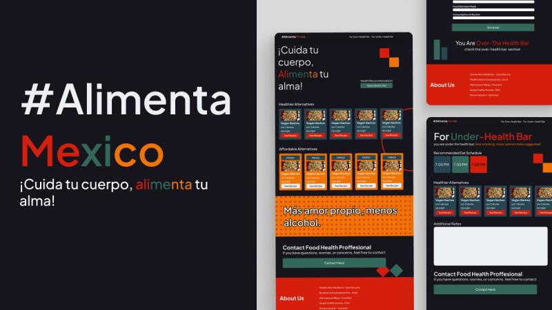

# # AlimentaMexico

## 🎯 Project Objectives
This project, named "#AlimentaMexico," originated from a challenge by OmahTI UGM. Our team was tasked with identifying a significant problem in a chosen country, developing a feasible, desirable, and viable solution, designing it, and transforming it into a working product within approximately three weeks. After extensive research, we identified health and obesity issues in Mexico, primarily caused by lifestyle and food choices, as our core problem.

Therefore, #AlimentaMexico was developed as a web-based solution designed to provide Mexican people with healthy food suggestions and offer an obesity detection feature based on user-inputted health data. Our aim is to empower individuals to make healthier food choices and better understand their health status.

## 📝 Methodology
#AlimentaMexico is built around two core functionalities: providing healthy food recipes and detecting obesity risk. The latter is powered by a Machine Learning model, which is my primary contribution to this project.

### 1. Obesity Detection Model Development (My Contribution)
My main contribution involved the development and integration of the obesity detection model. This model utilizes **XGBoost**, a powerful gradient boosting framework, for classification.

Here's a breakdown of the model development process, as implemented in `model.py`:
* **Data Preparation and Preprocessing:** The `datacom.csv` dataset was used, focusing on relevant features for obesity prediction. Key preprocessing steps included standardization using `StandardScaler` to normalize numerical features like Age, Height, Weight, NCP, BMI, CAEC, and FAF.
* **Handling Imbalanced Data:** To address potential class imbalance in the "NObeyesdad" target variable, a combination of over-sampling using SMOTE (for classes 0 and 1) and under-sampling using RandomUnderSampler (for class 2) was applied to balance the dataset, ensuring robust model training.
* **Model Training:** An `XGBClassifier` was initialized with optimized hyperparameters (e.g., `learning_rate=0.1`, `max_depth=3`, `n_estimators=150`) and trained on the preprocessed and balanced dataset.
* **Model Persistence:** The trained XGBoost model and the `StandardScaler` instance were saved using Python's `pickle` module, allowing them to be loaded and reused for predictions in the web application without retraining.

#### **API Development and Integration**
A Flask API was developed to serve the trained machine learning model, as implemented in `app.py`. This API handles incoming user data from the website, preprocesses it, makes predictions using the loaded XGBoost model, and returns the health status.

Key aspects of the API:
* **Model Loading:** The pre-trained `model.pkl` and `scaler.pkl` are loaded upon application startup to enable predictions.
* **Route Handling:** The API defines routes for various website pages (`/`, `/contacts`, `/health`, `/menu`, `/over`, `/under`) which render corresponding HTML templates.
* **Prediction Endpoint (`/predict`):** This route handles POST requests from the user input form. It extracts user-provided features, performs necessary transformations like converting height from centimeters to meters and calculating BMI, and then scales these features using the pre-loaded `scaler`.
* **Prediction and Output:** The scaled input data is fed into the loaded XGBoost model to predict the obesity status. Based on the prediction (e.g., "Under-Health Bar", "Over-Health Bar", or "Normal"), a dynamic status message and a corresponding link are generated and rendered back to the `health.html` template.

### 2. Website Design and Recipe Suggestions
The website provides an intuitive interface for users to input their health data for obesity detection. Beyond this, it offers various healthy food recipe suggestions, aiming to guide Mexican users towards better dietary choices. The design focuses on user-friendliness and clear presentation of health information and recipe alternatives.

## 📈 Results and Impact
#AlimentaMexico provides a practical tool for individuals in Mexico to assess their obesity risk and receive actionable advice through healthy food recipes. By combining data-driven insights with accessible web design, the project offers a tangible solution to a pressing public health issue. The use of XGBoost ensures a robust and accurate prediction model for obesity categorization.

## 👥 Team & My Contributions
This project was a collaborative effort by our team from OmahTI UGM.

The team members involved were:
* Mutiara Setya Rini 
* Joseph Greffen Komala
* Ken Bima Satria Gandasasmita
* Wibi Laksono Wijaya
* Nino Satwika Wandhana

**My Specific Contributions:**
My primary contribution to the #AlimentaMexico project was the **development of the Machine Learning model** for obesity detection. This involved:
* Implementing data preprocessing steps, including standardization and handling class imbalance using SMOTE and RandomUnderSampler.
* Training the XGBoost classification model.
* Serializing the trained model and scaler using `pickle` for deployment.
* Developing the Flask API endpoints to serve the model's predictions, handling data input, preprocessing, and output integration with the website's front-end.

## 🔗 Attachments

* **GitHub Repository:** [josephgreffenkomala/Mexico](https://github.com/josephgreffenkomala/Mexico)
* **Website Screenshot:**
    
