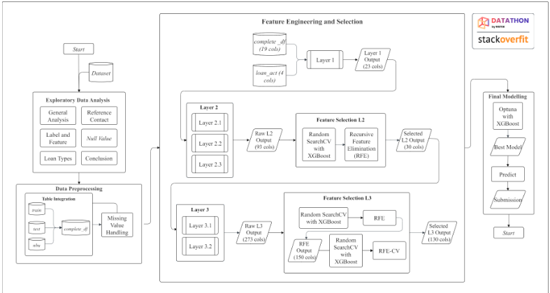
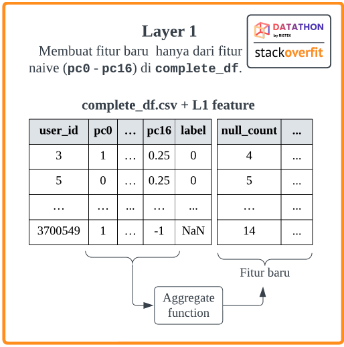
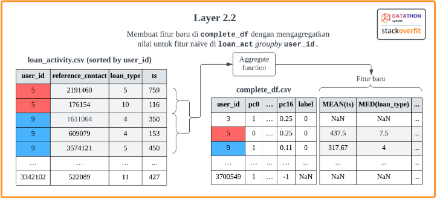
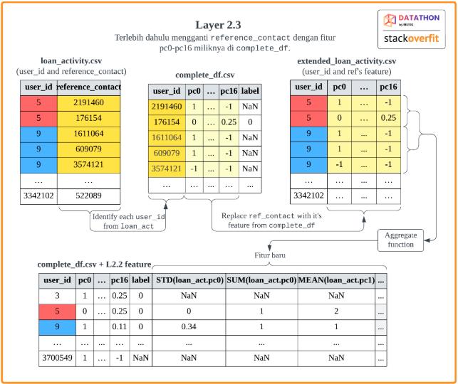
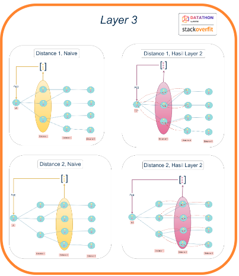
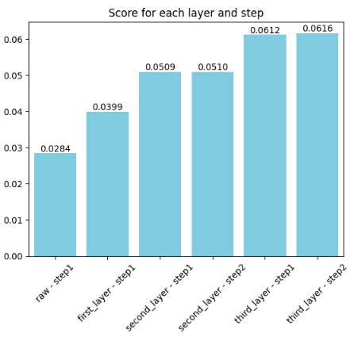
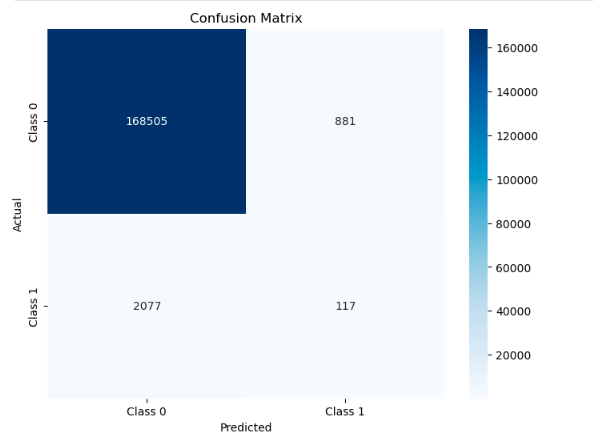

# Fraud Detection on a Fintech Platform: Leveraging Advanced Feature Engineering and XGBoost for RISTEK Datathon 2024

## 🎯 Project Objectives
This project was an assignment for the **preliminary stage of the RISTEK Datathon 2024**. The Kaggle competition challenged participants to develop machine learning models for **fraud detection on a fintech platform**, specifically identifying users who fail to repay borrowed financial products by the due date.

Participants were required to combine classification modeling with analytical insights into patterns of fraudulent behavior, aiming to enhance model interpretability. Evaluation was based on the private leaderboard score (25%) and the quality of analysis, data processing, modeling, and notebook organization (75%). The primary metric for model performance was Average Precision (macro-averaged), reflecting the model’s ability to accurately detect fraudulent users. Participants were encouraged to use diverse machine learning, mathematical, and statistical approaches to maximize model performance and showcase comprehensive notebook documentation.

## 📝 Methodology
To address the fraud detection challenge, our approach involved a comprehensive workflow encompassing data understanding, meticulous preprocessing, advanced feature engineering, and robust model training.

### Overview and Workflow

The overall workflow for this project can be outlined as follows:
* The process starts with **Exploratory Data Analysis (EDA)**, where we analyze general patterns, reference contacts, label and feature distributions, loan types, and missing values to gain an understanding of the dataset.
* Following this, the data undergoes **Data Preprocessing**, which involves integrating tables from various data sources (train, test, and non-borrower users) and handling missing values, resulting in a complete dataset called `complete_df`.
* In the **Feature Engineering and Selection** phase, the data is structured into multiple layers to generate more comprehensive features.
* For **Final Modeling**, we use XGBoost, optimizing its hyperparameters with Optuna. The best-performing model is then used for predictions and submission.

### Dataset
The competition dataset consists of four CSV files with the following details:
1.  `train.csv`
2.  `loan_activities.csv`: Contains records of financial product loans on the platform, including `user_id`, `reference_contact`, `loan_type`, and `ts` (timestamp of when the user made the loan).
3.  `non_borrower_user.csv`: Contains data of users who are not classification targets due to their tendency to rarely make loans, including `user_id` and `pc[0-16]` (obfuscated user identity features).
4.  `test.csv`

### Focusing on Feature Engineering

In feature engineering, we employed two paradigms: a **tabular data paradigm** and a **graph/network paradigm**, leveraging all available datasets. For the tabular paradigm, we utilized **Deep Feature Synthesis (DFS)** from the Featuretools library, while for the graph paradigm, we implemented the **Breadth-First Search (BFS)** algorithm. These paradigms were divided into three layers: Layer 1 and Layer 2 focused on tabular data, while Layer 3 explored graph data. Below is a breakdown of each layer:

1.  **Layer 1**:
   
    Generates new DFS features using only the `complete_df`.
2.  **Layer 2**: Combines data from `complete_df` and `loan_act` to create DFS features, structured into three sub-layers.
    * **Layer 2.1**: Merges `complete_df` and `loan_act` on `user_id`, creating new features by aggregating values based on `user_id`.
    * **Layer 2.2**: Extends Layer 2.1 by further aggregating the `reference_contact` column for each `user_id`.
      
    * **Layer 2.3**: Develops profile-based features tailored to loan types.
      
3.  **Layer 3**: 
   
   Implements BFS to treat each `user_id` as a node, aggregating features from adjacent nodes (`reference_contact`) to generate new features. This layer is divided into two sub-layers:
    * **Layer 3.1**: Aggregates features from nodes at a distance of 1 (direct neighbors).
        * *Naive features*: Aggregates basic features at distance 1, capturing information about users directly connected to the target user (Local User, LU), such as their Reference Contacts (RCs).
        * *Layer 2 features*: Aggregates Layer 2 features at distance 1, providing insights about users connected to the RCs of the LU.
    * **Layer 3.2**: Aggregates features from nodes at a distance of 2.
        * *Naive features*: Aggregates basic features at distance 2, capturing details about users connected to the LU within two degrees of separation.
        * *Layer 2 features*: Aggregates Layer 2 features at distance 2, offering information about RCs of users located two degrees away from the LU.

Layer 3 thus creates new features encapsulating the relationships between users and their neighbors within distances of 1 and 2, as well as the connections between their neighbors. Weighted averages are applied to these features, assigning higher weights to features from distance 1 compared to those from distance 2.

## 📈 Results and Evaluation
Our modeling approach using XGBoost and advanced feature engineering yielded insightful results, although with identified areas for improvement in fraud detection.

### Execution Duration Analysis
From the analysis, it can be observed that the execution duration of each layer varies, with a general increase as the layer level progresses:
* **Layer 1** has the shortest execution time.
* **Layer 2** execution time is longer than Layer 1, but shorter than Layer 3.
* **Layer 3** has the longest execution time.
This trend is likely due to the increasing complexity of feature engineering processes at higher layers, which require more computation time. A notable drop in execution time occurs in **second layer - step 2**, primarily because of feature selection using the Recursive Feature Elimination (RFE) method. This process reduces the number of features used in the model, thus improving execution speed.

### Accuracy Improvement Through Feature Engineering

Based on the plot , the accuracy score improves progressively with each stage:
* Starting from raw data in **Layer 1** to after applying feature engineering in **Layer 2** and **Layer 3**, this demonstrates the effectiveness of feature engineering in enhancing the model's quality.
* However, in **second layer - step 2** and **third layer - step 2**, the score improvements are marginal (relatively stagnant). This may be attributed to feature selection, which improves model quality by eliminating irrelevant features but does not always yield significant accuracy gains.

### Model Performance: Confusion Matrix Insights

The confusion matrix provides insights into the model's performance in detecting fraud cases (Class 1) and non-fraud cases (Class 0):
* Of 170,583 instances classified as **non-fraud (Class 0)**:
    * 168,505 were correctly classified as non-fraud.
    * 881 were misclassified as fraud (**false positives**).
* Of 2,194 instances classified as **fraud (Class 1)**:
    * Only 117 were correctly identified as fraud.
    * 2,077 were misclassified as non-fraud (**false negatives**).

The high number of false negatives indicates that the model struggles to detect fraud cases, which is a critical area for improvement to make the model more effective in real-world applications.

## 🔗 Attachments
* **Kaggle Competition Link:** [https://www.kaggle.com/competitions/ristek-datathon-2024](https://www.kaggle.com/competitions/ristek-datathon-2024)
* **Notebook (Stack Overfit):** [Datathon/Stack Overfit_Notebook.ipynb at main · josephgreffenkomala/Datathon](https://github.com/josephgreffenkomala/Datathon/blob/main/Stack%20Overfit_Notebook.ipynb)

---