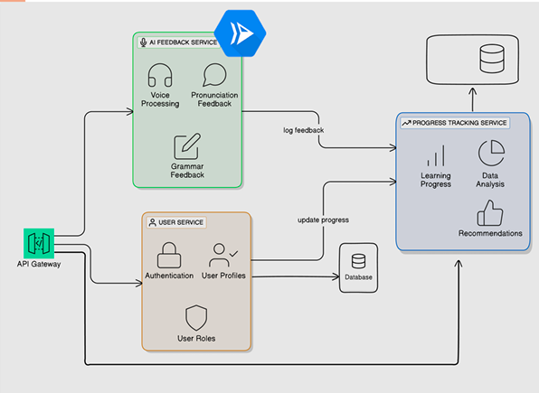
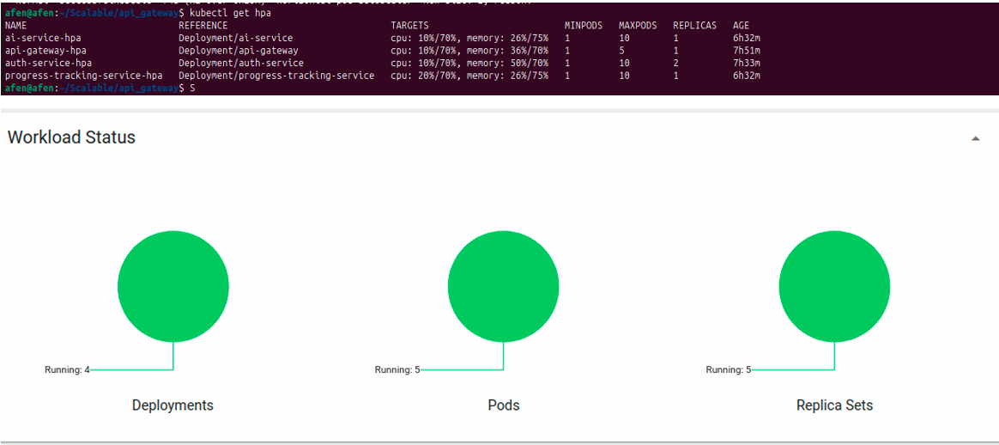
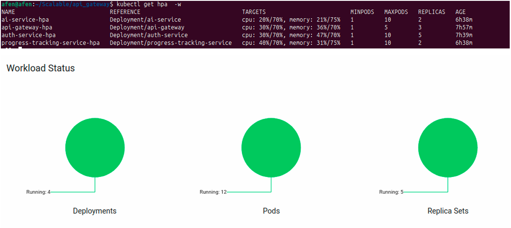

# Scalable English Learning Platform with AI Feedback

## 🎯 Project Objectives
 This application is designed as a digital learning platform aimed at helping users improve their English language skills.  To achieve this, the platform is built upon a modular and scalable microservices architecture.  A key feature is the utilization of Artificial Intelligence (AI) to analyze user audio, providing direct feedback on pronunciation, grammar, and other aspects for an interactive and effective learning experience.

The core objective is to support high **scalability**, enabling the system to efficiently handle an increasing number of requests. By leveraging technologies such as **Horizontal Pod Autoscaler (HPA)**, **Docker**, and **Kubernetes**, the application ensures optimal performance even under heavy workloads. The main goal is to create a scalable solution to meet evolving business needs.

## 📝 Methodology
 The platform employs a robust microservices architecture, separating the system into independent parts based on functional domains.  This design choice significantly enhances scalability, especially when orchestrated with Kubernetes.  All services communicate using REST API over HTTP, maintaining statelessness to facilitate scaling.

 The platform consists of four interconnected core services:

### Application Architecture

1.   **API Gateway**: Acts as the main entry point for all client requests, routing them to the appropriate internal services (AI, Progress Tracking, or Authentication).  It also manages platform scalability.  Built with Express.js, it supports dynamic routing, validation, JWT authentication middleware, and global error handling.
2.   **AI Feedback Service**: The primary feature of the learning platform, responsible for providing real-time automatic assessment and feedback on user speaking abilities, including detecting filler words, incorrect punctuation, and capitalization.  Developed with Flask and Python, it is designed to be stateless, processing all data in real-time without storing session or user status internally.  It integrates a health check endpoint and a `POST /speech2text` API for text analysis.  After providing feedback, it logs the assessment results to the Progress Tracking Service.
3.   **Progress Tracking Service**: Serves as the user's personal data hub, systematically logging all learning activities, scores, duration, and AI feedback].  Based on this historical data, it provides personalized learning recommendations.  This service is also stateless, with all user data stored externally in MongoDB.  It offers endpoints for logging activities (`/api/progress/activityLog` ) and retrieving user history (`/api/progress/activityLog/:userId`).
4.   **User Authentication Service**: Ensures data security and personalization by managing user identities and guaranteeing only authorized users can access their data and learning history.  Built with Node.js, Express.js, and TypeScript, it utilizes PostgreSQL via Supabase for data storage and supports JWT-based authentication.  This service is designed to be highly scalable as it primarily interacts with the database only during user login or token refresh.

### Containerization & Orchestration
All services are containerized using **Docker** to ensure consistent environments and portability. These containers are then orchestrated by **Kubernetes (K8s)**, with the API Gateway acting as the entry point and orchestrator.

To achieve automatic scalability, Kubernetes' **Horizontal Pod Autoscaler (HPA)** is utilized.  HPA continuously monitors resource usage (CPU and memory).. If the average resource usage reaches a threshold (e.g., 70%), HPA automatically scales up by adding more instances (pods) to handle increased load.  Since all services are stateless and data is stored externally, this scaling process is safe, allowing Kubernetes to dynamically add or reduce container replicas without data loss or status inconsistency.

### Resource Allocation
Each service defines minimum resource requests and maximum resource limits for its containers:
* **Minimal Resource Requests**:
    *  CPU: "10m" (10 millicores or 1% of one CPU core).
    *  Memory: "128Mi" (128 Megabytes).
* **Maximum Resource Limits**:
    *  CPU: "40m" (40 millicores or 4% of one CPU core).
    *  Memory: "256Mi" (256 Megabytes).

This configuration provides a clear target for HPA. When load increases, CPU usage rises from the request limit towards the maximum limit. If average CPU usage across all instances hits the HPA target (e.g., 70% of 40m), HPA scales up.  Conversely, when the load drops, HPA scales down to save resources.

## 📈 Scalability Analysis & Results
To analyze and test the platform's scalability, we implemented a load testing script using the **k6** framework.  This script simulated concurrent user access to several main services via the API Gateway.

### Test Configuration
* **Virtual Users (VUs)**: 20 virtual users simulated simultaneous access.
*  **Duration**: The test ran for 30 seconds.
*  **Pacing**: Each virtual user paused for 2 seconds after completing one request cycle.
*  **User Flow Scenario**: Each virtual user executed a sequence of actions reflecting typical application usage, involving four different endpoints in order:
    1.  User Login (`POST /auth/api/auth/login`)
    2.  AI Text Analysis (`POST /ai/speech2text`)
    3.  Progress Recommendation (`GET /progress/api/progress/recommendation/123`)
    4.  System Health Check (`GET /health`)

 The primary goal was to generate sufficient load to trigger Kubernetes' automatic scaling mechanism (HPA).

### Test Results
* **Before Testing:** The Kubernetes system was stable with a total of 5 active pods across 4 deployments.  Each service had an initial HPA configuration of 1 pod, except for `auth-service` which had 2 pods.
    
*  **During Testing (Scale Up):** As the test ran, the total number of pods automatically increased to 12 due to HPA activation.  Specifically, API-Gateway scaled to 3 pods, AI Service to 2 pods, Auth Service to 5 pods, and Progress Tracking Service to 2 pods.  This demonstrated that HPA successfully added pods to maintain performance as workload increased.
    
*  **After Testing (Scale Down):** Once the test concluded, the number of pods gradually decreased to 6 as the workload on each service reduced.  This confirmed that the autoscaling mechanism (HPA) effectively adjusted the number of pods dynamically.  Some services maintained more than one pod, as the system does not immediately revert to the initial state, awaiting traffic stability to prevent unnecessary fluctuations.

## 👥 Team & My Contributions
This project was a collaborative effort by our team.

The team members involved were:
* Joseph Greffen Komala
* Hafid Sasayuda Ambardi
* David Neilleen Irvinne
* Nugroho Adi Susanto

**My Specific Contributions:**
My primary contributions to this project included:
* **Development of the API Gateway:** Responsible for creating the central entry point for all client requests and managing communication routing between microservices.
* **Integration of Docker for each Service:** Ensuring that all individual services were properly containerized using Docker for consistency and portability across different environments.
* **Creation of Kubernetes Configurations:** Developing the necessary Kubernetes manifests (deployment, service, HPA configurations) to orchestrate and manage the containerized services.
* **Implementation of Horizontal Pod Autoscaler (HPA):** Setting up and configuring HPA to enable automatic scaling of pods based on resource utilization, a key aspect of the project's scalability goal.
* **Load Testing:** Participating in and conducting load tests using k6 to validate the system's performance and autoscaling capabilities under simulated heavy loads.

## 🔗 Attachments

* **Final Project Report (Laporan Akhir Proyek):** [Link to PDF](APznzaYyxP3O5FwAw5vdNwsMgSULaZZTn3pzJ2C9SK60CPVnyLhWxCVnK_5XHmcO2n3JmtHr9sRYZDHkpJtDThK9euqN0_Pq-bSfKXJbpVzvi9U1UhFfQ_6QXK-7NWvuPmbxJj2bTYwHT_2vviT-P-mIfW2aakLMXFAdFDHOxlOb3vIBfxoT2jHzzOa8o-DrytCVgSKsMOLUFV2Z3pXstA.pdf)
* **GitHub Repository (API Gateway - My Contribution):** [https://github.com/josephgreffenkomala/api_gateway](https://github.com/josephgreffenkomala/api_gateway)
* **GitHub Repository (AI Service - Hafid):** [HafidAmbardi/AIfeedackservice](https://github.com/HafidAmbardi/AIfeedackservice)
* **GitHub Repository (User Authentication - Nugroho):** [https://github.com/csfighterrr/scalable-auth](https://github.com/csfighterrr/scalable-auth)
* **GitHub Repository (Progress Tracking - David):** [https://github.com/david-irvinne/progress_tracking_service](https://github.com/david-irvinne/progress_tracking_service)
* **Architecture Diagram:**
    

---