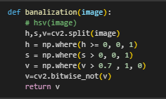
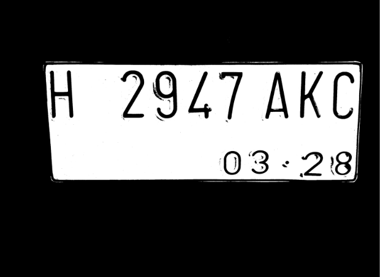
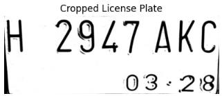
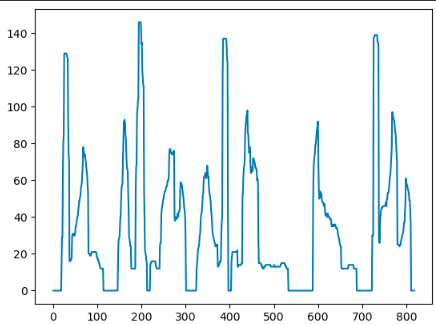
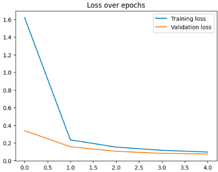
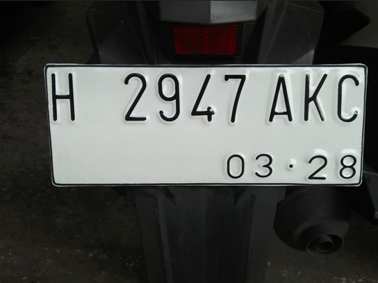
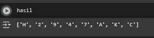

# AnaKosan: AI Model for Vehicle License Plate Detection

## 🎯 Project Objectives
The "AnaKosan" project focuses on developing an artificial intelligence-based vehicle license plate identification software, specifically for implementation in automatic gates. The objective is to simplify the identification process, making it affordable and feasible for small-scale applications such as boarding houses (kos-kosan). This project aims to address the challenges of license plate detection in various conditions, including dynamic scenarios and complex environmental settings.

## 📝 Methodology
In developing this license plate detection model, we adopted and implemented a comprehensive series of methods, based on the reference paper "A New Method to Detect the License Plate in Dynamic Scene". This methodology combines traditional image processing techniques with the power of deep learning through Convolutional Neural Networks (CNN).

In general, the vehicle license plate identification process in this model follows these stages:
1.  **Acquiring an image**: Obtaining the vehicle image to be processed.
2.  **Image preprocessing**: Preparing the image for subsequent stages.
3.  **Locate the license plate**: Identifying the license plate area within the image.
4.  **Regulate the license plate**: Adjusting the detected license plate.
5.  **License plate**: Producing the regulated license plate.
6.  **Database processing**: Processing vehicle information or feedback related to the license plate.

Here is a detailed explanation of each key stage in the implemented methodology:

### 1. Image Preprocessing
This stage is crucial for improving image quality and preparing it for more accurate detection.
* **HSV Color Space Conversion (HSV Conversion)**:
    * The HSV (Hue, Saturation, Value) color model is used because it is more effective in separating license plate areas from background noise, especially under dynamic lighting conditions. This contrasts with the RGB model, which is heavily influenced by illumination.
    * Hue (H) represents color by degree (e.g., green: $120^{\circ}$), Saturation (S) indicates color purity (0: gray), and Value (V) is the brightness level.
* **Banalization (Binarization)**:
	* 
    * After HSV conversion, the image is transformed into a binary (black-and-white) format. This process is performed separately on each channel (H, S, V) of the converted HSV image, and then an AND operation is applied to eliminate most background interference.
    * Its primary goal is to simplify the image and remove noise by converting bright pixels to white and dark pixels to black based on a certain threshold.
    * Binarization in the HSV space proves to be better at excluding interference like headlights or car logos compared to the RGB space.
    * 

### 2. Morphological Positioning
To detect candidate license plate areas, we use morphological operations such as erosion and dilation.
* **Erosion:** Shrinks foreground objects, useful for removing small noise.
* **Dilation:** Expands foreground objects, capable of filling small gaps.
* We combine the *close* operation (dilation followed by erosion) to connect adjacent targets, and then the *open* operation (erosion followed by dilation) to eliminate small objects.
* Subsequently, *cropping* is performed to obtain the detected license plate area. This involves identifying rectangular contours with a specific aspect ratio (e.g., 3.14 for blue-white plates) to ensure it is a genuine license plate.
* 

### 3. Character Segmentation
Once the license plate is successfully cropped, the next step is to separate each character on the license plate.
* We use a horizontal projection method to identify and separate the characters.
* This includes handling cases where characters are not stuck together (using the horizontal center distance of adjacent characters) and cases where characters are stuck (finding the maximum gap based on vertical projection).
* 
* The output of this stage is individually isolated characters, ready to be recognized by the model.

### 4. Character Recognition based on CNN
For the character recognition stage, we chose to use a Convolutional Neural Network (CNN). CNN models are highly effective for image recognition tasks due to their ability to automatically extract features.

* **CNN Architecture:** The CNN architecture we used consists of several convolutional layers, pooling layers, and fully connected layers.
    * **Conv1:** 96 filters with $11\times11$ kernel, stride 4.
    * **Pool1:** Max pooling with $3\times3$ kernel, stride 2.
    * **Conv2:** 256 filters with $5\times5$ kernel, padding 2.
    * **Pool2:** Max pooling with $3\times3$ kernel, stride 2.
    * **Conv3 & Conv4:** 384 filters each with $3\times3$ kernel, padding 1 (no pooling layers).
    * **Conv5:** 256 filters with $3\times3$ kernel, padding 1.
    * **Pool3:** Max pooling with $3\times3$ kernel, stride 2.
    * **FC6 & FC7:** Fully connected layers with 4096 neurons.
    * **FC8:** Fully connected layer with 65 neurons for output probability prediction of characters.

## 📊 Dataset
The dataset used to train this model is "**haarcascadeplatenumber**" available on Kaggle. This dataset focuses specifically on **Indonesian motorcycle license plates** and contains **1000 images for each character**. 
## 📈 Results and Evaluation
The "AnaKosan" model demonstrates sufficiently accurate prediction capabilities. The performance evaluation of the CNN model can be seen from the loss graph during the training process:

The `Loss over epochs` graph illustrates how both *training loss* and *validation loss* decrease as the number of epochs or iterations increases, indicating that the model learns well and converges.

The reference paper also provides a comparison of accuracy and detection time with other methods:

| Model | Accuracy | Time (t) |
|---|---|---|
| BP-neutral network | 92.3% | 0.953 |
| Pattern matching method | 80.4% | 0.192 |
| CNN | 98.8% | 1.16 |
| The comprehensive model of this paper | 96.9% | 0.517 |
*Note: This table is from the reference paper and shows the accuracy of the "comprehensive" model within that paper's context, which also refers to the use of CNN.*

**Example Detection Results:**
Here is an example of a license plate successfully processed by the model, showing the cropped result and the recognized characters:
* **Original License Plate:**
    
* **Predicted Characters:** `['H', '2', '9', '4', '7', 'A', 'K', 'C']`
    

This project successfully detects license plates consistent with the original image. Its application in daily life can be adapted to user capabilities and needs.

## 👥 Team & My Contributions 
This project was a collaborative effort. The team members involved were:
- **Reyhan Alfarel Qadavi**
- **Rizka Nurdiana**
- **Mutiara Setya Rini**
- **Joseph Greffen Komala**
- **Salmaa Ceiba Abdillah** 

**My Specific Contributions:** As a key member of the team, my responsibilities included directing and dividing tasks related to the model's development, providing guidance, overseeing progress, and integrating the final results. I was also specifically involved in the creation and implementation of the Convolutional Neural Network (CNN) model used in this project.
## 🔗 Attachments

* **Reference Paper:** [A New Method to Detect the License Plate in Dynamic Scene](https://github.com/josephgreffenkomala/TPSC-Car_plate_detection/blob/main/A_New_Method_to_Detect_the_License_Plate_in_Dynamic_Scene%5B1%5D.pdf)
* **Dataset:** [haarcascadeplatenumber - Kaggle](https://www.kaggle.com/datasets/caasperart/haarcascadeplatenumber/data)
* **Notebook:** [Google Colab Notebook AnaKosan](https://colab.research.google.com/drive/1VP0pfI79o4Ki92CofoFgo66SRcN3wXh0?usp=drive_link)
* **Presentation:** [Google Drive Presentation TPSC 4 (AnaKosan)](https://drive.google.com/file/d/1uyL4zJOQlX4AyLw5l2VrXbmPnHG6jaIG/view?usp=drive_link)
* drive: [TPSC 4 - anaKosan - Google Drive](https://drive.google.com/drive/folders/1J46yR6J_VNQ6XyorzObuVqeNq7EomXXJ)
